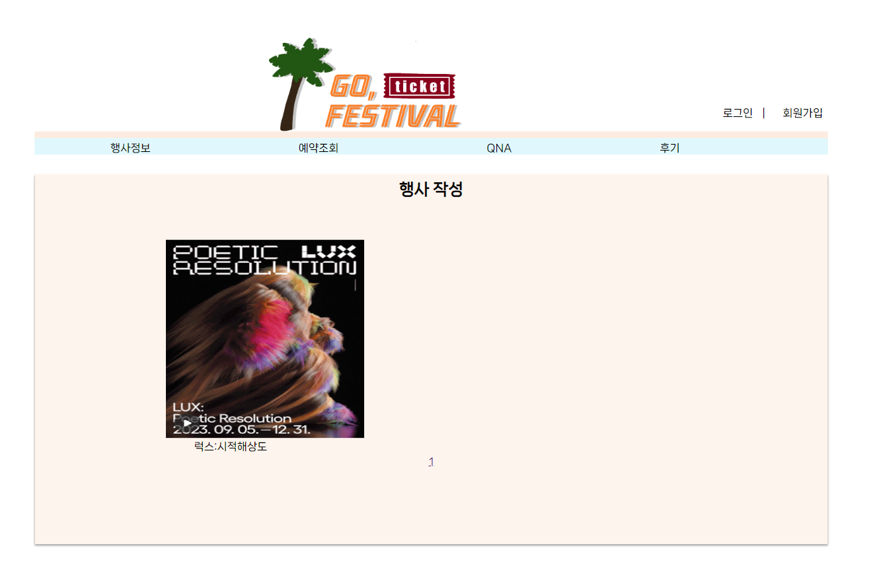
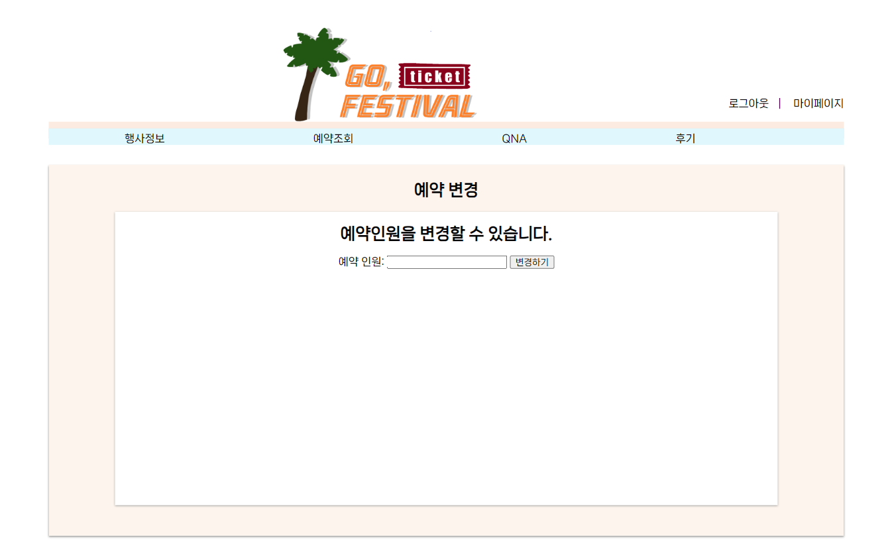
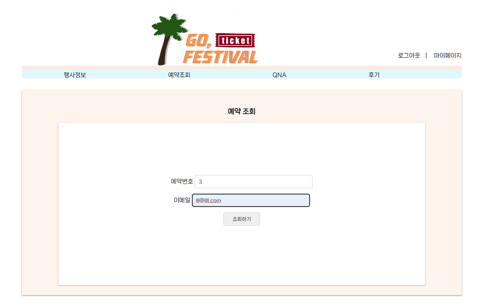
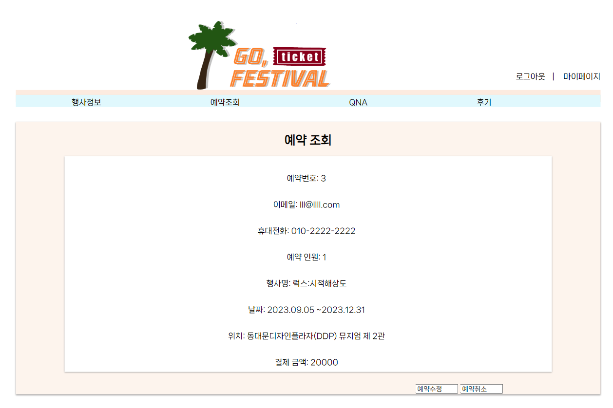
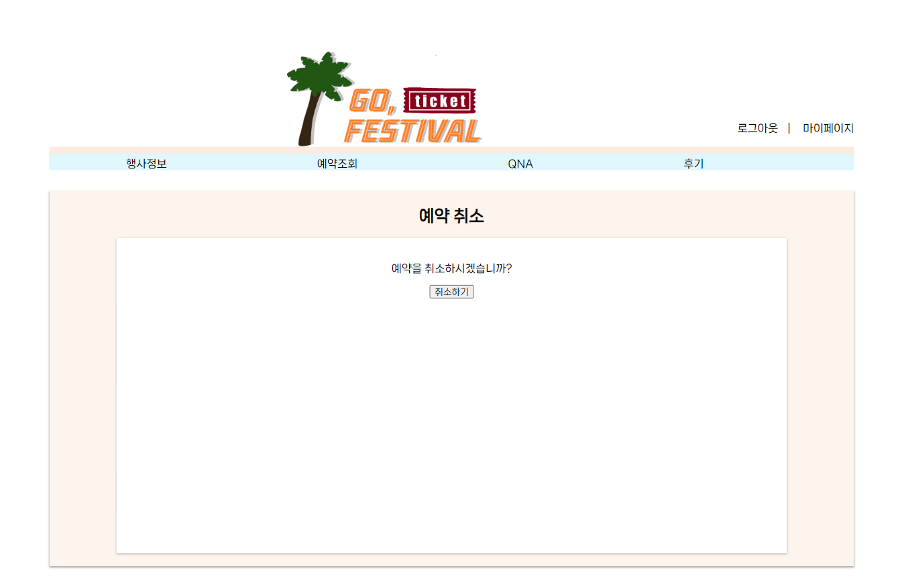
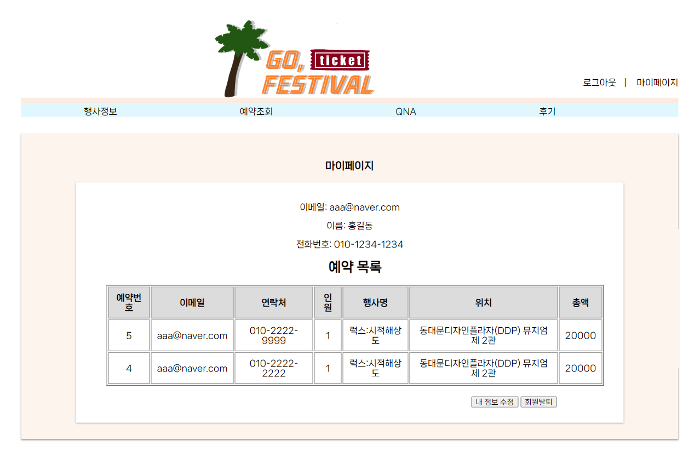
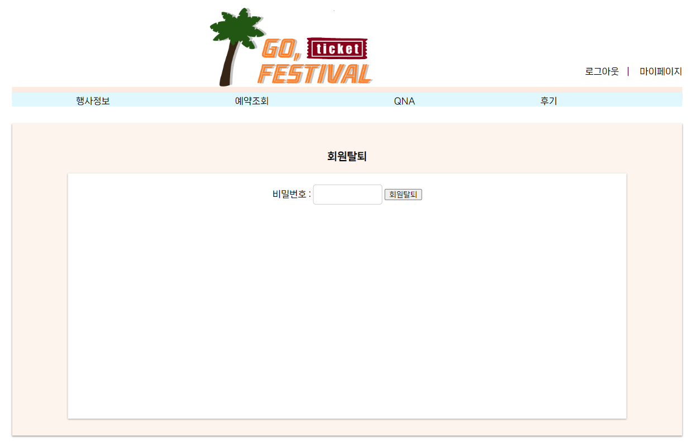

### README
# GO, Festival

   
  

   

## 프로젝트 소개

흩어져있는 행사들 모여라!  평소 전시/관람/패스티벌에 대한 정보를 얻기는 쉽지만 한번에 정보를 모아서 보기 힘들어 프로젝트를 기획하게 되었습니다.

<a href="https://drive.google.com/file/d/1mG-G1pvNusgcNeo4dG5fRqusZKPWVOaS/view?usp=sharing">https://drive.google.com/file/d/1mG-G1pvNusgcNeo4dG5fRqusZKPWVOaS/view?usp=sharing<a>

   
   
   
   
   
   
   
   
   

 

## 기술 스택

| JavaScript |    Java    |   HTML     |     css    |    oracle  | 
| :--------: | :--------: | :--------: | :--------: | :--------: |
|   ![js]    |  ![java]   |  ![html]   |  ![css]    |  ![oracle] |

 

## 구현 기능

### 예약
- 등록되어있는 행사를 예약할 수 있도록 함.
### 예약 조회/취소
- 예약정보를 조회 하고 취소할 수 있도록 함.
### 예약 정보 수정하기
- 예약 수정기능을 통해 예약 인원수를 수정할 수 있도록 구현함.
### 마이페이지
- 마이페이지를 구현해 회원의 정보를 볼 수 있도록 하고 예약목록을 마이페이지에서 볼 수 있도록 구현함. 
또한 마이페이지에서 회원 탈퇴 및 회원의 정보를 수정할 수 있도록 구현함.
### 로그인
- 로그인 기능을 통해 회원이 로그인을 할 수 있도록 구현함
### 회원가입시 아이디 중복체크
- 회원가입시 아이디 중복체크를 할 수 있도록 구현함

## 배운 점 & 아쉬운 점

처음 프로젝트를 시작할 때 페이지간에 값을 전달하고 받는 것에 대한 궁금증이 항상있었는데 이번 프로젝트를 통해서 그 궁금증이 많이 해소되었고 값을 넘기고 받는데 있어서 원하지 않는 값이 들어간다든지, null 값이 자꾸 들어간다든지 하는 문제가 있었는데 해당 부분은 코드 작성시 값을 전달해주는 것을 잊거나 오타 때문에 발생하였던 부분이였습니다.  
로그인 기능 구현시 로그인 정보를 세션에 저장하여 구현하였습니다. 로그인 정보를 바탕으로 로그인 상태를 유지할려고 하였는데 로그인 상태가 유지 되지 않았습니다. 이 경우도 해당하는 값을 제대로 가져오지 못해서 생긴 결과 였습니다. 로그인 정보로 받아왔던 이메일 값을 중점으로 로그인을 유지하니 해결이 되었습니다.  
예약시 데이터베이스에 insert하는 과정에서 무결성 제약조건에 위배되는 경우가 많이 있었는데 이 부분은 시퀀스로 예약번호를 자동으로 생성하는 과정에서 시퀀스번호가 충돌되어 값이 중복되어 생긴 일이라 중복값을 처리해주니 해결이 되었습니다. 
회원가입시 중복값을 처리해줄때 회원가입 페이지로 넘어올 시 null값이 들어오는 것이 항상 문제였습니다. 이부분을 예외처리를 통해 해결하였고 조건을 설정하여 해당조건과 일치하면 아이디가 중복되었다는 알림창이 뜨도록 조건을 수정해주자 해결이 되었습니다.

아쉬운 점 
 
예약 기능이 해당 행사 기간 이후에는 예약할 수 없고 예약 취소시 기간에 따라 금액이 차감되는 등 예약기능이 디테일 하지 못한 점이 아쉬웠습니다.
 

<!-- Stack Icon Refernces -->

[js]: ./readme-static/img/javascript.svg
[java]: ./readme-static/img/java.svg
[html]: ./readme-static/img/html.png
[css]: ./readme-static/img/css.png
[oracle]: ./readme-static/img/oracle.png
